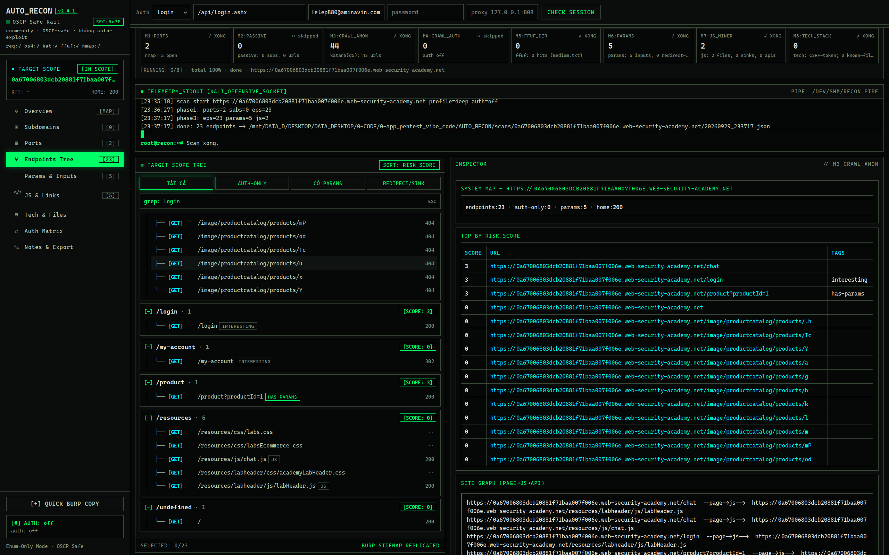
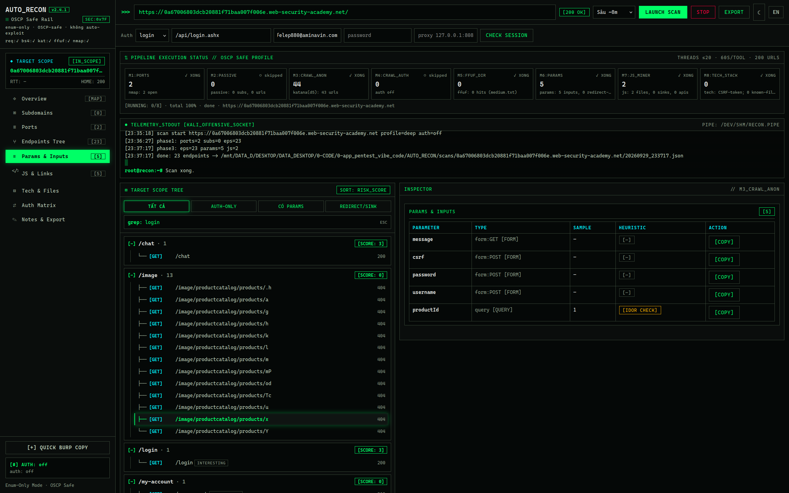

# AUTO_RECON SYSTEM — tôi chán recon kiểu khổ sở, nên tôi build cái này

Tôi đã từng recon như thế này: mở 5–6 tab terminal cùng lúc — một tab `nmap`, một tab `katana`, một tab `ffuf`, thêm tab `waybackurls`… output trôi vèo vèo, mắt dán vào chữ trắng nền đen đến mỏi nhừ. Quét xong lại copy từng URL sang Burp bằng tay. Login vào lab rồi mà tool vẫn quét chay như chưa hề đăng nhập. Cuối buổi nhìn lại: một đống output rời rạc, không biết endpoint nào đáng nhìn, không biết mình đang ở bước nào.

Nếu bạn thấy quen quen, thì **AUTO_RECON SYSTEM là dành cho bạn**.

Nó là một hệ thống **all-in-one**: bạn dán 1 domain vào, bấm **1 nút Scan**, rồi ngồi xem — ports, subdomains, endpoints (cả click-được lẫn ẩn), params, JS/secrets, tech-stack, files nhạy cảm — tự đổ về **một màn hình duy nhất**, theo thời gian thực, endpoint nào “thơm” nhất tự trồi lên đầu. Không chuyển tab. Không copy-paste thủ công. Không mỏi mắt.

## Vì sao nó khác tool lẻ

| Nỗi đau recon thủ công | AUTO_RECON lo cho bạn |
|---|---|
| Chạy từng tool, gom output bằng tay | 8-engine pipeline chạy song song: ports → passive → crawl anon/auth → ffuf → params → JS → tech |
| Không biết endpoint nào đáng test | Heuristic score tự xếp hạng (auth-only, DOM sink, redirect-param lên đầu) |
| Quét chay dù đã login | Auth matrix **anon vs auth**: login 1 lần (cookie/Bearer/user+pass), tool quét 2 lượt và chỉ ra endpoint chỉ hiện khi login |
| Copy request sang Burp mỏi tay | **Repeater built-in**: sửa raw request ngay trong app, bấm SEND, đọc response tại chỗ |
| Quét hôm nay khác hôm qua mà không biết | Diff 2 bản scan (new/lost), lưu mọi kết quả theo `scans/<host>/<ts>.json` |
| Report lab viết lại từ đầu | Export Markdown/CSV/JSON 1 click, note từng endpoint |
| Terminal mỏi mắt | UI terminal-grade 2 theme (dark phosphor / light lab), scanlines, glow — mà vẫn đọc rõ |

## Nhìn là hiểu (scan thật trên PortSwigger lab)


*Cây endpoints group theo segment, chip method/status, sort theo risk-score — click vào là thấy ngay JS, form, diff anon-vs-auth.*


*Bảng params toàn site: sample value, heuristic IDOR/open-redirect, copy 1 click.*

## 30 giây là chạy

```bash
python3 app.py 8000
# mở http://127.0.0.1:8000 → dán target → chọn profile → Launch Scan
```

Không `pip install`, không Docker, không framework. Chạy offline trên Kali. Cần gì thêm thì nó tự dùng đồ có sẵn: `nmap`, `katana`, `ffuf` (thiếu tool nào nó fail-soft, báo rõ, không crash).

3 profile 1-click: **Nhanh (~2’)** trinh sát gọn · **Sâu (~8’)** đào kỹ + recurse · **OSCP-thi** (tắt passive, threads thấp — đúng luật thi).

## Tôi build nó clean để ai cũng maintain được

- `config.py` — mọi giới hạn (timeout, threads, cap URL) nằm 1 chỗ, không số magic rải rác
- `core/` — scope guard, fetch thật-thà (302 vẫn là 302), parser thuần dễ test
- `modules/` — 1 file = 1 engine = 1 hàm `run()`, hỏng module nào scan vẫn tiếp tục
- `tests/` — **52 tests + 5 checks Node PASS**: lab giả lập có login/auth-only/DOM-sink, scan thật end-to-end, Selenium bấm từng tab trên Firefox headless
- 2 ngôn ngữ VI/EN (mặc định Việt), evidence hygiene: secret che `đầu…cuối`, pass không bao giờ ghi disk

## Cam kết OSCP-safe

Enum-only. Không sqlmap/nuclei/auto-exploit, không kết luận vuln — tool chỉ gắn tag *candidate* và gợi ý checklist test tay. Repeater là để **bạn** tự gửi request vào **target của bạn**, có scope-guard chặn ngoài-scope.

> ⚠️ Chỉ dùng trên target bạn được phép test (lab, exam, scope bug-bounty). Tôi không chịu trách nhiệm nếu bạn chĩa nó vào chỗ không được phép.

## Map nhanh cho người mới mở repo

```
app.py            routes + API (SCHEMA=2)
config.py         limits + profiles + 8 modules
core/             scope / http / parse / jobs (JobEngine) / store
modules/          ports, passive, crawl, brute, params_js, tech, auth
index.html + static/   UI offline (dark/light, VI/EN)
words/            wordlist small/medium · scans/  kết quả (gitignored)
tests/            suite đầy đủ · tests/manual/  test UI bằng Firefox
```

API: `POST /api/scan` · `GET /api/progress?job` · `GET /api/result?job&cat=` (9 cats) · `POST /api/send` (repeater) · `POST /api/check-session` · `POST /api/cancel` · `GET /api/diff` · `GET /api/health`.

Test toàn bộ: `python3 tests/run_all.py`
